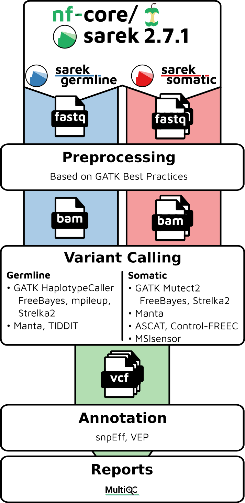
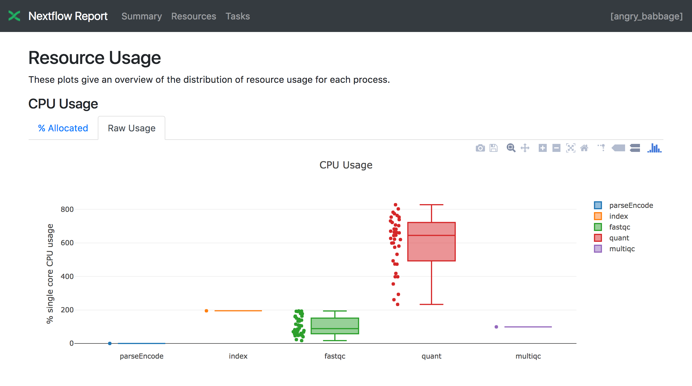
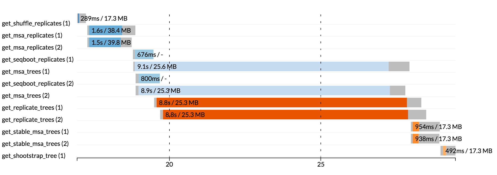

---
title: "Running the nf-core pipeline- sarek on nimbus instance"
author: "Nandan Deshpande"
date: "25 Nov 2021"
output:
  html_notebook:
    number_sections: yes
    theme: united
    toc: yes
    toc_float: yes
  html_document:
    df_print: paged
    toc: yes
editor_options:
  chunk_output_type: inline
---
__Last updated__: `r Sys.Date()`

```{r, echo=FALSE}
library(knitr)
opts_chunk$set(fig.align = "center")
knitr::opts_chunk$set(fig.width=20, fig.height=8) 
```


# Description
SIH Project: [XXXX](https:)


# People

__SIH staff members__

* Tracy Chew (Group Lead)
* Nandan Deshpande 
* Georgina Samaha


# Compute facilities

Nimbus - Pawsey Supercomputing Centre

Project: Running nf-core pipelines on nimbus instance

Directory: 


# PRIMARY REFERENCES
[Sarek](https://nf-co.re/sarek)


# Sarek Variant calling pipeline
{width=40%}


## Reference Genomes
[iGeneomes](https://nf-co.re/usage/reference_genomes)
```{r}
* Illumina has developed a centralised resource called iGenomes. 
* Most commonly used reference files are organised in a consistent structure for multiple genomes.
* A copy of iGenomes are uploaded onto AWS S3 and nf-core pipelines are configured to use this by default
* By default, the pipeline will automatically download the required reference files when you run the pipeline if you give an appropriate genome key (eg. --genome GRCh38).

# Important
* Downloading the files takes time and bandwidth, so it is recommended to make a local copy of the iGenomes resource if possible. Once downloaded, you can customise the variable params.igenomes_base in your custom configuration file to point to the reference location. 

#For example:
params.igenomes_base = '/path/to/data/igenomes/'
Using --genome <id> will then look to your local system for the reference instead of AWS S3.

```

## Sarek pipeline 'Usage' 
[Click for details](https://nf-co.re/sarek/2.7.1/usage)
```{r}
Typical command
nextflow run nf-core/sarek --input <sample.tsv> -profile docker

The pipeline will create the following files in your working directory:
  work            # Directory containing the nextflow working files
  results         # Finished results (configurable, see below)
  .nextflow_log   # Log file from Nextflow
  # Other nextflow hidden files, eg. history of pipeline runs and old logs.
  
# The "-resume" option
Specify this when restarting a pipeline. Nextflow will used cached results from any pipeline steps where the inputs are the same, continuing from where it got to previously.
You can also supply a run name to resume a specific run: -resume [run-name]. Use the nextflow log command to show previous run names.

```

## Sarek pipeline 'Parameters' 
```{r}

# Some important parameters
--input      Path to input file(s) : Use this to specify the location of your input TSV file
--step       Starting step (Default : mapping)
--outdir     The output directory where the results will be saved (Default: './results')

--tools      Tools to use for variant calling and/or for annotation.
#By default, the pipeline currently performs the following:

* Sequencing quality control (FastQC)
* Map Reads to Reference (BWA mem)
* Mark Duplicates (GATK MarkDuplicatesSpark)
* Base (Quality Score) Recalibration (GATK BaseRecalibrator, GATK ApplyBQSR)
* Preprocessing quality control (samtools stats)
* Preprocessing quality control (Qualimap bamqc)
* Overall pipeline run summaries (MultiQC)

--genome      Name of iGenomes reference.
--cpus        default: 8
--max_memory  default: '128 G' (This default values caused a bit of grief due to my initial ignorance). The available memory on the instance was smaller and hence the runs crashed! 

```


## nf-core sarek test run(s)

```{r}
Path on the nimbus instance
/data/SIH/pipelines/nfcore_tests/sarek
```


### Run-1 - Test run with default tools
```{r}
Command: 
nextflow run nf-core/sarek -profile test,<docker/singularity/podman/shifter/charliecloud/conda/institute>
  
* We used the following command
nextflow run nf-core/sarek -profile test,singularity


```

### Run-2 - Test run with additional tools
```{r}
* We used the following command
nextflow run nf-core/sarek -profile test,singularity --tools mpileup,Strelka,snpEff,Mutect2 --use_gatk_spark
```

### Run-3 - With a subset (1 million reads) of 2 sample Normal/Tumour pairs - with a selected set of variant calling and annotation tools
```{r}
* We used the following command
nextflow run nf-core/sarek -profile singularity --save_reference \
         --tools Strelka,Mutect2,snpEff    \
         --input example_pair_subset_fastq.tsv     \
          --outdir results --genome GRCh38 \
          --max_memory '40.GB' -with-report sarek_report


```


## Tracing & visualisation
There are multiple approached by which detailed logs are provided for nextflow pipeline runs
Click [here](nextflow.io/docs/latest/tracing.html#tracing-visualisation) for more details

```{r}

# Execution log 
Command
nextflow log <run name> [options]

The log option is useful after a pipeline has already run and is available for every executed pipeline.

# Execution report

# Nextflow can create an HTML execution report: a single document which includes many useful metrics about a workflow execution.
To enable the creation of this report add the -with-report command line option when launching the pipeline execution. 
  For example: 
    nextflow run <pipeline name> -with-report [file name]
```


*** An execution report was generated for the above run (Run 3). Please click [here](Run3_sarek_report.html) ***


```{r}
# Trace report
Nextflow creates an execution tracing file that contains some useful information about each process executed in your pipeline script, including: submission time, start time, completion time, cpu and memory used.

In order to create the execution trace file add the -with-trace command line option when launching the pipeline execution. 
For example:
  nextflow run <pipeline name> -with-trace

```

```{r}
# Timeline report
Nextflow can render an HTML timeline for all processes executed in your pipeline

To enable the creation of the timeline report add the -with-timeline command line option when launching the pipeline execution. For example:
  nextflow run <pipeline name> -with-timeline [file name]
```





Execution report and the trace report must be specified when the pipeline is first called. By contrast, the log option is useful after a pipeline has already run and is available for every executed pipeline.


## Other nf-core pipelines which were tested (test runs) on the bioinstance
1. [rnaseq](https://github.com/nf-core/rnaseq)
2. [smrnaseq](https://nf-co.re/smrnaseq)
3. [ampliseq](https://nf-co.re/ampliseq)


